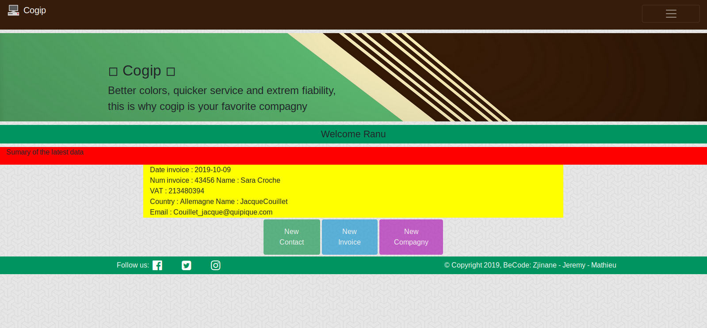
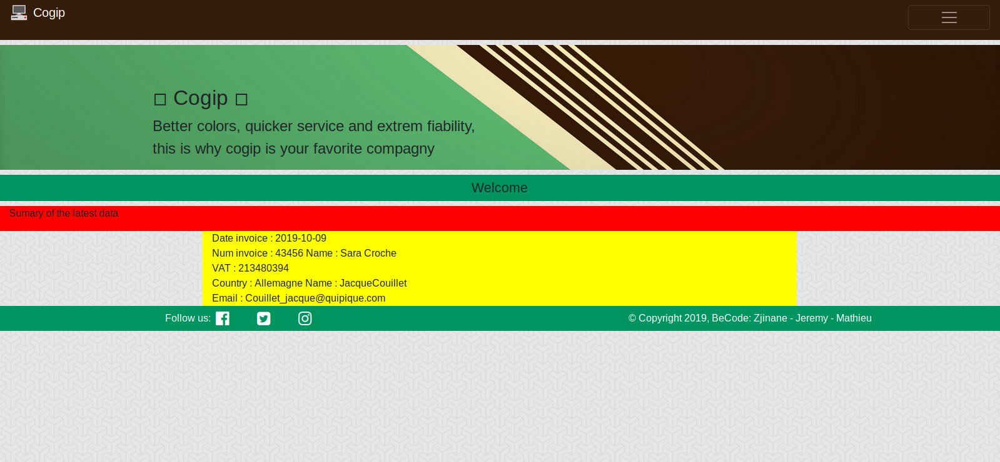
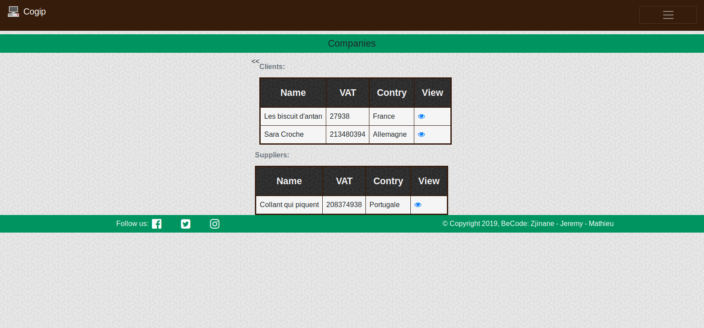
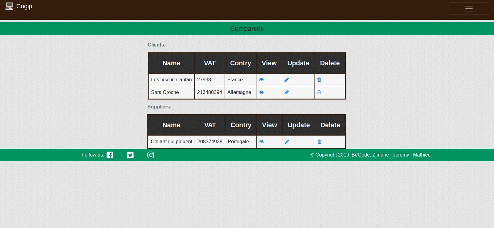
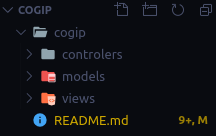
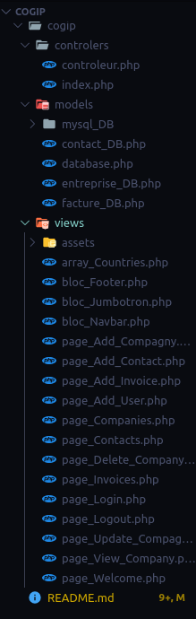
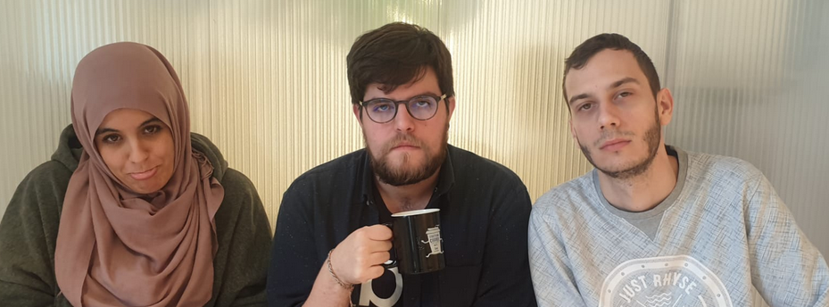

# 💼 Cogip

 

◽️ Website connected to a Database  ◽️

 

<a href="https://github.com/Zjinane" target="_blank">Zjinane 👩‍💻 </a> - <a href="https://github.com/Shaunyx" target="_blank">Jeremy 👨‍💻</a> - <a href="https://github.com/MathieuKruk" target="_blank">Mathieu 👨‍💻</a>

<h2>💻 Visuel 💻</h2>

<h2>💻 Vous pouvez voir le resultat ici 💻</h2>

<a href="###" title="Link of project" >Click here </a>

 

 

<h2>💻 Structure du fichier MVC  💻</h2>

 

 

<h2>💻 Languages utilisés 💻</h2>

<ul>
    <li>Html </li>
    <li>Scss --> Css </li>
    <li>PHP </li>
    <li>Mysql, Mysqli syntax </li>
    <li>C.R.U.D method & MVC Structure</li>
</ul>

 

 

<h2>💻 Objectifs de projet 💻</h2>

Projet d'un site dynamique mettant en relation un base de données avec des tableaux HTML.
Le tout cherchant à amener des informations demandées par un tiers via une interface simple et efficace.

 

 

<h2>💻 Reviews des membres et de leurs travailles 💻</h2>

<ul>
    <li><q>Plus tu apprends des choses, plus tu réalises que tu ne connais rien !</q>
<small> ~Mathieu</small>
</li>
    <li><q>Cela était interressant de travailler sur ce projet de groupe, Le projet en soit était coriace mais la partie backend m'a appris pas mal de chose.</q>
<small> ~Jinane</small>
</li>
    <li><q>Entre phases de stress, fatigue et joie a propos du backend, travailler sur CE projet mais aussi avec mes collegues en "pair(parfois "trio") coding" était tres enrichissant et m'a fait entre appercevoir ce qu'est de travailler en groupe sur un projet</q>
<small> ~Jérémy</small>
</li>
</ul>

<h2>💻 Reviews du systeme du projet management  💻</h2>

    <q>Nous avons commencées à établir un plan d'action dès le premier jour, cela en ciblant les points forts de chacuns et les faiblesses.  Une fois identifié(e)s chacuns travaillaientt indépendamanet tout en communiquant au moindre probleme qui nous resistaient, aussi lors d'un puch sur notre repository Github ou même lors une pause pour faire un check selon chacuns.  La plus grosse difficulté pour nous trois était de comprendre le systeme "C.R.U.D" mais également la structure "MVC" ( M-odels, V-iew, C-ontroler).  Ensuite le projet c'est bien passé pour le reste en nous fixant comme dès le début des objectifs à atteindre par jour où selon les besoins urgents !</q>

<h2>💻 Liens 💻</h2>

 

 

 in real 

